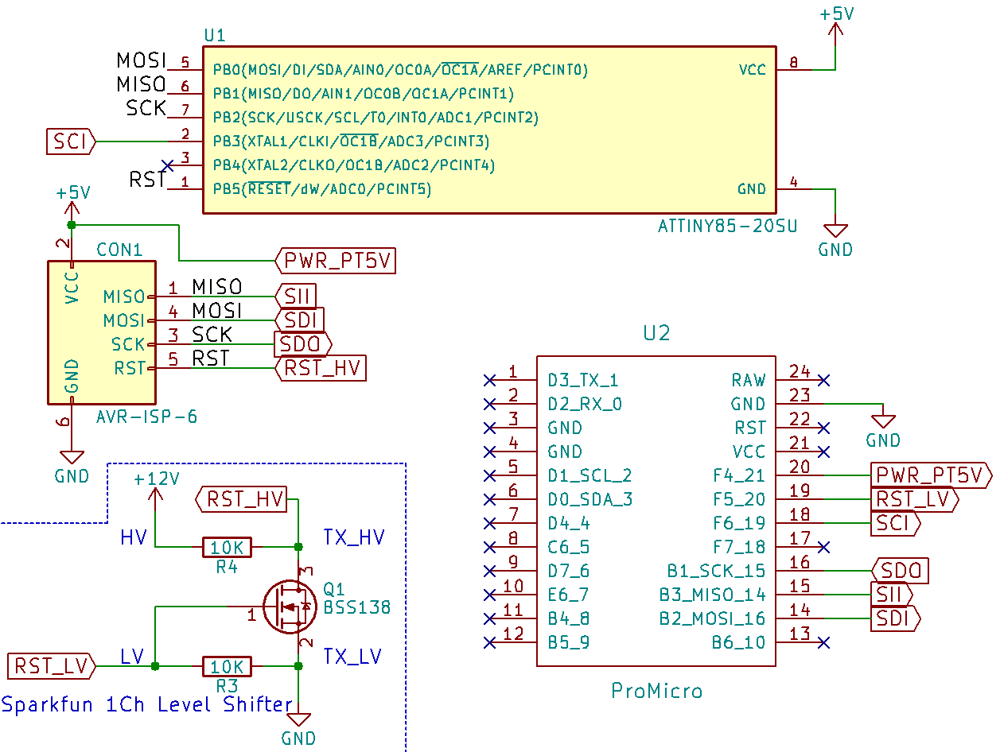

# AVR high-voltage serial programming for ATtiny
After possibly bricking your AtTiny, what do you do?

There is some different places on the web with information about what can be done and so on, 
[such as this](https://github.com/tsaarni/avr-high-voltage-serial-programming)

But most of them use a bit complex schematics ...
You might be like me that you are lazy, don't have to much to work with and already have ISP header that you want to use.
So what is the easiest way to do this without to many connections and I found that I had some
[sparkfun level shifters](https://learn.sparkfun.com/tutorials/retired---using-the-logic-level-converter) laying around which could be used to get the 12V supply to reset.

## Schematic

Basic schema for using a Pro Micro (Sparkfun or similar clone) and external 12v with level shifter

Note that level shifter connections are used differently

Shifter Pin | usage
--- | ---
Low side TX input | to Ground
Low side Power in (LV) | used as input and connected to pro micro signal pin
High side Power in (HV) | to 12V source
GND | not connected

This creates an inverter with high voltage output (but with a low 10K pull-up) pull-up might be to low, but worked for me

## Code for Pro Micro with above Schematics

See [ATTinyFuseReset.ino](ATTinyFuseReset/ATTinyFuseReset.ino) for actual code, run it and connect serial monitor and send anything to start FUSE reset

## Datasheet

Atmel
[ATtiny datasheet](http://www.atmel.com/images/atmel-2586-avr-8-bit-microcontroller-attiny25-attiny45-attiny85_datasheet.pdf)
chapter "High-voltage Serial Programming" is the method that is used here.

Normal serial programming method can be used again after running FUSE reset.
